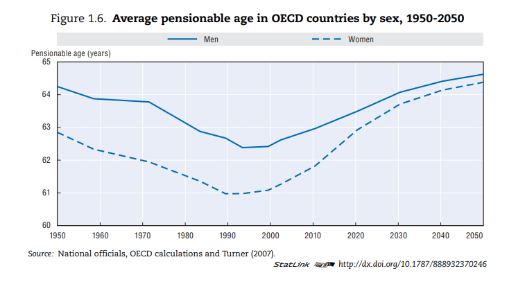

```{r setup, include=FALSE}
knitr::opts_chunk$set(echo = TRUE)
```

# Introducción

Importancia de alargar vida laboral, @ocde11.


Desde la década de 1980 se acumula evidencia de que los Sistemas Jubilatorios y los incentivos que generan para los trabajadores son un factor determinante de la oferta laboral de los mayores de 55 años.

Muchos países implementaron cambios en el diseño y los parámetros de sus sistemas jubilatorios para incentivar a los mayores continuar en el mercado laboral. 

Presentamos la evidencia de los resultados de estas políticas.

# Tendencias

Envejecimiento poblacional.

## Esperanza de vida de los mayores y tiempo esperado de retiro

Si bien en la primera parte del siglo pasado los aumentos en la esperanza de vida fueron causados principalemnte por caídas en la mortalidad infantil, a partir de mitad de siglo, también hubo caídas importantes en la mortalidad de los mayores (@ocde11).

En efecto, en los países de la OCDE, la esperanza de vida a los 65 años de edad aumentó 3.9 años para los hombres y 5.4 para las mujeres entre 1960 y 2010 (@ocde11). En Uruguay, COMPLETAR.

## La actividad laboral de los mayores

Otro factor que impacta directamente en la sostenibilidad financiera de los sistemas jubilatorios, es la participación laboral de los mayores, sensiblemente menores a las de los más jóvenes. 

La participación de los mayores en el mercado laboral ha seguido un patrón de U desde los años 70s del siglo XX. La caída pronunciada hasta los años 90s se revirtió en mucho países, conformando un patrón en forma de U (@NBERc14190). En los apartados X y Y, presentamos la evidencia disponible sobre el impacto de los incentivos producidos por los sistemas previsionales en este fenómeno.

El siguiente gráfico muestra el aumento de la tasa de actividad en las personas de entre 55 y 64 años en varios países.

Sin embargo, estos aumentos no compensan el aumento en la longevidad mencionados anteriormente. Aún con edades de retiro efectivas mayores, OCDE proyecta que la esperanza de vida luego de la edad normal de retiro aumente en la mayoría de los países miembro (@ocde19). 

Sin embargo, en 2011 sólo 5 países de la OCDE -Hungría, Italia, Corea del Sur, Turquía y el Reino Unido- habían logrado aumentar estas edades suficiente para estabilizar la duración esperada de los períodos de retiro. El aumento del tiempo esperado de retiro amenaza la sostenibilidad fiscal de los sistemas previsionales de reparto.


## Políticas para favorecer el empleo de los mayores


En la década de 1970 y 1980 muchos países desarrollados flexibilizaron el acceso a las jubilaciones para favorecer el empleo juvenil. (CITA). Esta flexibilización se hizo mediante la rebaja de las edades mínimas de eligibilidad, el acceso a otros programas de seguridad social y la eliminación de ajustes actuariales por el retiro temprano. 

Si bien los efectos esperados sobre el empleo juvenil no se materializaron, si se produjo una caída importante de la edad de retiro del mercado laboral. El gráfico siguiente muestra la edad de retiro proyectadas de los países de la OCDE entre 1950 a 2050. El mínimo se alcanzó en 1993, y no se espera que se recuperen las edades de 1950 hasta 2050.



En la década de 1990 empezó a surgir evidencia de que las reglas de los sistemas jubilatorios generaban incentivos al retiro temprano y eran uno de los principales factores que explicaban la caída en la participación laboral de los mayores (@gruber99).

Esta caída, combinada con el aumento en la longevidad mencionado antes impactaba directamente en la sostenibilidad de los sistemas jubilatorios de reparto.

Para aliviar este problem, a partir de los años 2000 se empiezan a implementar medidas para revertir este fenómeno, favoreciendo el alargamiento de la vida laboral de las personas. En particular, las edades a los que los trabajadores pueden acceder a distintos niveles de beneficios en los sistemas jubilatorios son un parámetro clave para la decisión de los trabajadores de retirarse del mercado laboral y/o acogerse a estos beneficios.

### Edad Mínima de Retiro

En este contexto, La edad mínima de retiro surge como un parámetro clave en cualquier sistema previsional. Es la menor edad a la que un trabajador puede recibir una prestación del sistema jubilatorio. Si bien este suele ser un parámetro muy saliente en todo sistema previsional, es usual que los trabajadores cuenten con otros vías para retirarse del mercado laboral antes de esta edad (seguro de desempleo prolongado, , seguro de enfermedad, pensiones por invalidez, etc.). En muchos países, estas vías terminan funcionando como esquemas de retiro temprano.

El siguiente gráfico muestra la EMR de los países de la OCDE en 2018. El promedio es XX. La tendencia en las últimas décadas fue aumentar esta edad (@ocde19).


### Edad Normal de Retiro e incentivos a diferir el retiro

La Edad Normal de Retiro es la menor edad a la que un trabajador puede acceder a una prestación del sistema jubilatorio sin recibir penalizaciones por retiro temprano. Uno de los hechos estilizados encontrado en la literatura es que una gran proporción de los trabajadores se retira la EMR o la ENR. 


Para Uruguay, ver @forteza. En este contexto, aumentar estas edades surge como una medida con potencial de ser altamente eficaz para prolongar la vida laboral de los trabajadores.

La estructura de ests ajustes definen los incentivos a diferir el retiro, ya que penalizan el retiro temprano y estimulan el retiro tardío.

[Pensions at a glance 2019 fig 1.12]

El siguiente gráfico muestra el aumento en la tasa efectiva y normal de retiro promedio en los países de la OCDE. @ocde17

[Pensions at a glance fig 2.6.]


# Impacto de la Seguridad Social en la oferta de trabajo


## Marco Teórico

El marco teórico mas usado para analizar el impacto de los parámetros de los sistemas previsionales en las decisiones de retiro es un modelo en el que el trabajador representativo maximiza la utilidad derivada del consumo de bienes y de ocio.

La utilidad del trabajador depende positivamente de ambos. Si decide trabajar más, puede consumir más pero se ve obligado a disfrutar de menos ocio, por lo que existe un _trade off_ entre ambos bienes.

El sistema jubilatorio afecta esta decisión a través de dos canales: el precio relativo de ambos bienes y la riqueza total del individuo. En efecto, si el sistema penaliza más el trabajo, el ocio se vuelve más barato relativo al consumo. Por otro lado, si las prestaciones del sistema se reducen, el precio relativo de ambos bienes se mantiene pero el trabajador va a acceder a un menor nivel de ambos.

Este modelo se puede extender para analizar fenómenos más complejos. En primer lugar, el modelo supone que no hay restricciones de liquidez. Esto implica que el trabajador tiene acceso al mercado financiero, lo que le permite suavizar su consumo. Si, por el contrario, el trabajador enfrenta restricciones de liquidez, es posible que se vea obligado a seguir en el mercado de trabajo por más tiempo para mantener sus niveles de consumo.

Por otro lado, el modelo no permite analizar decisiones conjuntas de miembros de un mismo hogar. Algunos trabajos extienden este modelo para analizar los impactos de los sistemas de seguridad social en los hogares. En este marco, si el ocio de uno de los integrantes del hogar es un bien complementario al del otro, los incentivos que enfrenta uno de los integrantes del hogar afectan a otros. Esto permite explicar como, por ejemplo, algunas parejas deciden retirarse juntas.

Otro fenómeno relevante es el de señalización. En este marco, las edades de retiro dispuestas en las reglas de los sistemas jubilatorios actúan como señales para que los trabajadores se retiren.

Finalmente, otro de los aspectos importantes a tener en cuenta en la decisión de retiro es la existencia de oportunidades en el mercado de trabajo para los trabajadores. Estos aspectos implican tomar en cuenta la demanda de trabajo de parte de las empresas y la discriminación que pueden sufrir los trabajadores mayores en el mercado de trabajo.


## Midiendo los incentivos de la Seguridad Social

Importancia de elegir los incentivos correctamente desde el punto de vista de la equidad y la eficiencia. La eficiencia implica que los ingresos obtenidos del sistema jubilatorio guarde relación con los aportes realizados durante la vida activa, y que no haya incentivos al retiro temprano.

La equidad implica asegurar un nivel de consumo adecuado a todos los mayores. 


### Tasa de Reemplazo

El indicador más simple para medir los incentivos que enfrentan los trabajadores a la hora de retirarse es la tasa de reemplazo. Esta tasa mide la relación entre lo que percibe en el mercado laboral y lo que recibe como prestación una vez que se acoge a los beneficios del sistema previsional.

En la mayor parte esta tasa es creciente con la edad. En Uruguay, COMPLETAR.
Sin embargo, este no es el único parámetro que los trabajadores tienen en cuenta cuando deciden retirarse.


### Riqueza Jubilatoria y el impuesto implícito al trabajo

Para entender mejor esta decisión, es necesario tomar en cuenta el concepto de Riqueza de la Seguridad Social o Riqueza Jubilatoria. Esto es el valor presente de todos los pagos que recibe un trabajador del sistema de jubilatorio.   La Riqueza de la Seguridad Social (SSW) para una edad de retiro $h$ es el valor actualizado de los beneficios recibidos entre $h + 1$ y la fecha de muerte $S$, si el trabajador se retira a la edad $h$:

\[ SSW_{h} = \sum_{s=h+1}^{\S} \rho_{s} B_{s}(h)\]

Para actualizar los beneficios se utiliza el factor de descuento $\rho$, que depende de la probabilidad de sobrevivencia y el factor de descuento intertemporal.


Una medida de incentivos fundamental es el cambio de la Riqueza Jubilatoria que obtiene un trabajador por diferir su retiro. El devengamiento de $SSW$ es la medida más simple de incentivo a trabajar, consiste en calcular el cambio en SSW por permanecer en la fuerza de trabajo un año más:

\[ SSA_{a} = SSW_{a+1} - SSW_{a}\]


- Gruber and Wise (2004) and Samwick (1998) argue that the accrual effect is the main driving source of retirement behavior in the reforms.


Este cambio depende de las características del trabajador y su interacción con las reglas del sistema que lo cubre y puede resultar del prolongamiento del tiempo de actividad o de la reducción del tiempo durante el que se reciben beneficios.


El impacto más importante de esta decisión es la caída en la Riqueza Jubilatoria por el período por el que el trabajador difiera el retiro. 

En un sistema de capitalización individual, por ejemplo, trabajar un año más implica que la cuenta de ahorro del trabajador recibe un año más de aportes, y estos aportes se capitalizan un año más por el rendimiento que obtienen estos ahorros. Por otro lado, la anualidad que recibirá el trabajador estará calculada en base a una esperanza de vida un año mayor, por lo que será más alta.

En sistemas de reparto, los incentivos que enfrenta el trabajador para trabajar un año más son diferentes. Estos incentivos dependen de la forma en que se actualizan los aportes realizados durante la vida del trabajador para calcular el sueldo jubilatorio, la forma en que se tomen en cuenta la historia laboral del individuo para este cálculo, y, en sistemas nocionales, el rendimiento de los aportes en el período en el que el trabajador difiere su retiro.

El impuesto implícito a seguir trabajando se calcula como:

\[ \tau_{a} = \frac{-SSA_{a}}{W_{a+1}} \]
      
      
Acá va la figure de micro estimation.

En algunos países, los sistemas jubilatorios implican pruebas de ingresos o de activos, o, como en Uruguay, existen trabas legales a que los trabajadores perciban ingresos del sistema jubilatorio mientras se mantienen activos.

En otros países, la decisión de retirarse del mercado de trabajo es independiente de la decisión de acogerse a los beneficios del sistema jubilatorio (UK, Noruega), por lo que la definición de retiro no implica una sino dos decisiones.


### Medidas más sofisticadas: Peak Value y Option Value

El principal problema que tiene es que esta medida solo mira un período para adelante, pero la SSA no se incrementa monotónicamente, sino que puede tener saltos. 

Eso implica que para un trabajador la SSA de un año puede ser baja, pero la de 4 años para adelante tener un salto brusco, por lo que el trabajador sigue trabajando teniendo ese salto en cuenta.


Es la diferencia máxima entre la riqueza de la seguridad social de retirarse hoy o retirarse en otra fecha:
    
\[ PV_{a} = max_{h}(SSW_{h}-SSW_{a}) \]
        
        
 Propuesta por @stock90: Option Value.
 
 Resultados empíricos usando estas medidas (@gruber04).


- Para América Latina: Cerda, Muñoz, etc.


<!--  -->

- Salida de Microestimation

<!--  -->


## Evidencia Reciente


Problemas de la evidencia anterior. Ex-ante, basada en simulaciones. La evidencia más reciente consiste en evaluar los efectos observados de medidas efectivamente implementadas. 


Los estudio ex-ante estiman menores impactos de la seguridad social en la participación laboral. Principales razones que atenúan las estimaciones:

Primero, no capturan efectos de posibles señales o normas sociales que generan las edades mínimas y normales. Segundo, los cálcuos de las medidas de incentivos tienen error de medida por falta de información sobre los contribuyentes (estructura familiar, etc.).

Tercero y más importante las estimaciones tienen sesgos de endogeneidad por las correlaciones entre las historias laborales, las preferencias por el trabajo y los incentivos al retiro.

En las últimas décadas, muchos países implementaron reformas paramétricas para estimular la participación laboral de los mayores. Estas reformas generaron una literatura creciente en los últimos años que usa diseños cuasi-experimentales para evaluar el impacto de estos cambios paramétricos en la participación laboral de los individuos.


### Impacto de Edad Mínima de Retiro

Rabaté, Staubli, ...


### Impacto de incentivos financieros y cambios en la Edad Normal de Retiro

Resumen de @mastrobouni09, @hanel09.


# Lecciones para Uruguay

- La edad mínima de jubilación es un instrumento altamente eficaz para prolongar la vida laboral de los mayores. Efecto señalización es parte del impacto.
- Los incentivos actuariales también funcionan.
- Jubilaciones mínimas pueden ser un incentivo a salir temprano del mercado a pesar de los ajustes actuariales.
- Ojo con los otros programas.
- Salud y educación, restricciones en las oportunidades de empleo.

# Glosario

Edad Efectiva de Retiro

:   Es la edad a la que un individuo empieza a recibir prestaciones del sistema de seguridad social.

Edad Mínima de Retiro

:   Es la menor edad a la que un trabajador puede aplicar a un programa de seguridad social. Es usual que en estos casos las prestaciones se vean reducidas frente a las recibidas en la edad normal de retiro.

Retiro Temprano

: Es la práctica de acogerse a los beneficios de la seguirdad social antes de la edad normal de retiro.

Prueba de Ingresos

: Es un límite a los ingresos que puede tener alguien que recibe prestaciones del sistema de segurida social.

Impuestos Implícitos

:  Es el impuesto implícito que enfrenta un trabajador cuando, pudiendo recibir una prestación del sistema de seguirdad social, decide seguir trabajando y sus beneficios futuros no son compensados.

Riqueza Jubilatoria

:  Es el valor descontado al momento del retiro de las prestaciones que recibe el contribuyente del sistema jubilatorio.

# Referencias

