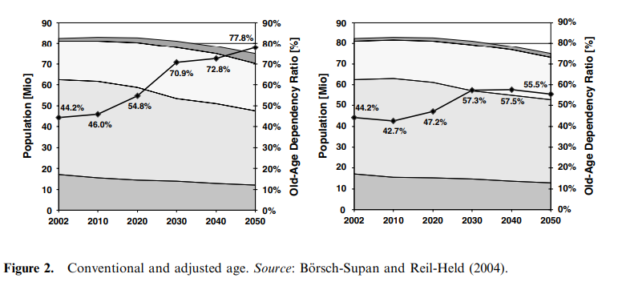
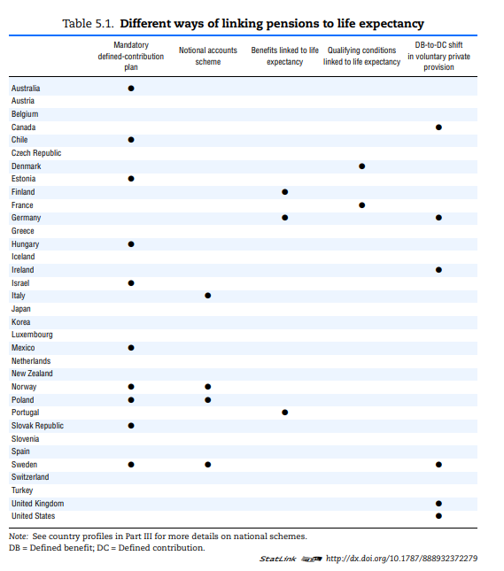
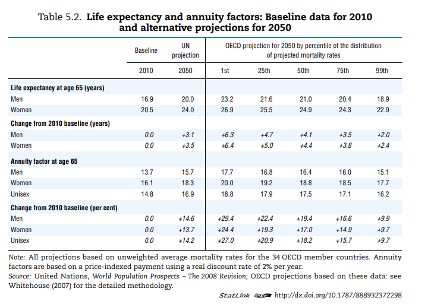
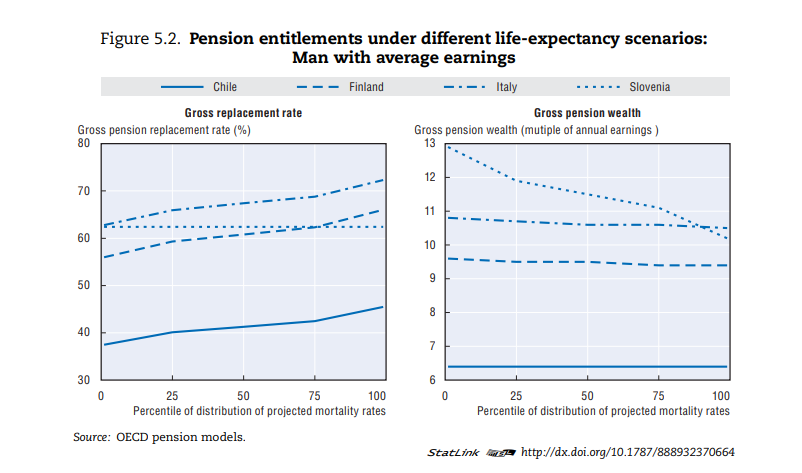
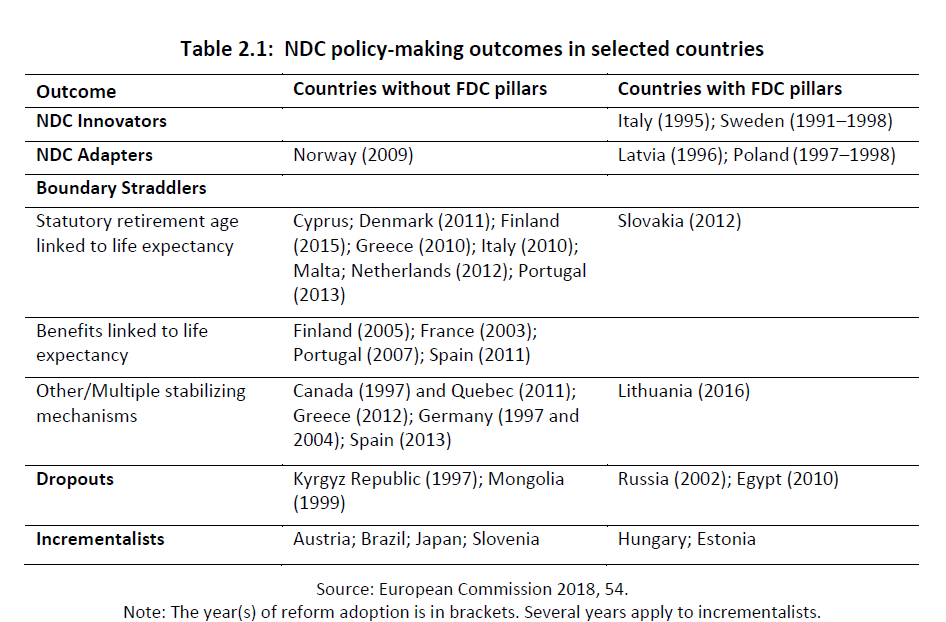

```{r setup, include=FALSE}
knitr::opts_chunk$set(echo = FALSE)
```

## (Börsch-Supan 2007): Opciones de diseño en los sistemas previsionales

- Sostenibilidad Financiera
- Efectos sobre la oferta laboral
- Distribución del ingreso.

## (Börsch-Supan 2007): Aspectos más salientes

- Reparto vs. Ahorro
- Contribución Definida vs. Beneficio Definido.

Los sistemas previsionales deben encontrar el mix óptimo entre las distintas propiedades de los sistemas.

## (Börsch-Supan 2007): Sistemas de Reparto y Beneficio Definido

- Ofrecen seguridad sobre los ingresos de los jubilados
- Solidaridad intergeneracional
- Vulnerables al riesgo demográfico (relación de dependencia)
- En estos sistemas la variable de ajuste es la tasa de contribución.

## (Börsch-Supan 2007): Beneficio no tan definido

- Las presiones demográficas vuelven los aumentos en las tasas de contribución demasiado altos.
- Es necesario reducir los beneficio para mantener la sostenibilidad de los sistemas.
- Hay una gama de sistemas intermedios entre Beneficio Definido y Contribución Definida, que permiten ajustar el equilibrio entre la seguridad de las prestaciones y la sostenibilidad del sistema.


## (Börsch-Supan 2007): La edad de retiro

- La relación de dependencia puede alterarse via cambios en la edad de reitro.
- Una idea natural es indexar la edad mínima de retiro a la esperanza de vida.

- Hay un alto grado de incertidumbre sobre el aumento futuro en la esperanza de vida.

- Esto hace que aumentar la edad de retiro mediante un esquema fijo (Alemania, EUA) no sea deseable

- Un compromiso razonable puede ser mantener fija la proporción de la vida que las personas pasan retiradas.

## (Börsch-Supan 2007): Proyección de la tasa de dependencia



## (Börsch-Supan 2007): Opciones

Las reformas tienen solo 4 opciones para ajustarse al envejecimiento demográfico:

- Bajar las tasas de reemplazo
- Aumentar las tasas de contribución
- Aumentar las edades de retiro
- Aumentar los niveles de ahorro previo.

## Caso Suecia

## Caso Alemania

## (Turner 2009): Ajustes Automáticos para restaurar la solvencia

- Las reformas ad-hoc tienen problemas para resolver los problemas de sostenibilidad de los sistemas previsionales.
- Por lo menos 12 países implementaron algún cambio automático para indexar las prestaciones a la esperanza de vida.


## (Turner 2009): Los mecanismos

- Frecuencia del ajuste
  - Cambios frecuentes (indexación de prestaciones iniciales a la esperanza de vida)
- Evento disparador
  - El ajuste tiene efecto si algún indicador de solvencia pasa cierto umbral.
- Disparador "duro" o "blando"
  - El gobierno puede tener mayor o menor grado de acción en las medidas implementadas para restaurar el equilibrio
- Mecanismo de ajuste
  - Tasas de contribución, tasas de reemplazo o edades de retiro.

## (Turner 2009): Indexación de los beneficios a la esperanza de vida

- Algunos países indexan alguno de los parámetros de la SS a la esperanza de vida.
- De esta manera, los trabajadores estan protegidos del "riesgo" de sobrevida respecto a su cohorte.
- Portugal y Japón reducen los beneficios al momento del retiro 1% si la esperanza de vida aumenta 1%.
- Otro mecanismo utilizado consiste en reducir el monto actualizado de la Riqueza Jubilatoria en la misma medida que el aumento en la esperanza de vida.
- Otro mecanismo es el aumento de la edad mínima con el aumento de la esperanza de vida. Se puede calibrar para mantener la relación de dependencia o el ratio de años retirado respecto al retiro.

## (Turner 2009): Experiencias de países

- Países con sistemas de reparto que indexan las jubilaciones a la esperanza de vida (Portugal y Finlandia).
- Países con Sistemas Nocionales (Italia y Polonia)
- Sistemas que indexan la edad mínima de retiro a la esperanza de vida (Reino Unido y Dinamarca).
- Países con mecanismos de ajustes atados a la solvencia del sistema (Suecia, Alemania, Japón, Canadá).
- Otros mecanismos (Francia).

## (Turner 2009): Ventajas y Desventajas

## (Turner 2009): Aspectos distributivos

## (OCDE 2011): Linking Pensions to Life Expectancy

- Contexto: aumento de la longevidad y sistemas de reparto
- Muchas de las reformas recientes en los sistemas previsionales hacen ajustes automáticos de los parámetros a la esperanza de vida.
- Además de los beneficios económicos, los ajustes automáticos pueden ser  atractivos si hacen más viables la reducción de los beneficios políticamente.

## (OCDE 2011): Distintas formas de vincular las jubilaciones a la esperanza de vida



## Sistemas de Contribución Definida

- El capital pensionario acumulado se convierte en una anualidad.
- La anualidad depende de la esperanza de vida del individuo.

## Sistemas Nocionales

- También implican el cálculo de una anualidad.

## Monto de las jubilaciones vinculadas a la esperanza de vida

- Finlandia y Portgugal indexan el valor de las jubilaciones con un factor que depende de la esperanza de vida.
- El sistema de puntos en Alemania ajusta el valor del punto a la relación demográfica del sistema.

## Condiciones de elegibilidad vinculadas a la esperanza de vida

- Dinamarca preveé vincular la edad mínima a la esperanza de vida a partir de 2027
- Italia en 2015 y Grecia en 2020.

## Incertidumbre en las proyecciones de la esperanza de vida




## Impacto de la mortalidad (1)




## (Guardiancich et al. 2019): Adopción de Esquemas NDC

- Se financian como los sistemas de reparto
- Los beneficios se calculan en base a los aportes de toda la historia laboral
- Se calcula una anualidad al momento de retiro tomando en cuenta la esperanza de vida a la edad de retiro.
- Tienen mecanismos para ajustarse frente a cambios en el entorno macroeconómico y demográfico.


## (Guardiancich et al. 2019):  Tipología en su adopción




## (Guardiancich et al. 2019): Olas

- ALAT adoptó sistemas de financiación individual antes de que los NDC estuvieran en la agenda.
- La primera ola incluyó a Suecia, Italia y algunos países de Europa del Este.
- La segunda ola fue en países de la ex- Unión Soviética y fue frágil
- La tercer ola implicó la adopción de mecanismos de ajuste sin sistemas NDC completos.

## (Guardiancich et al. 2019): Marco Conceptual

- Problema

Para que una reforma sea adpotada es necesario que se perciba un "problema".

- Política (policy)

Es necesario que exista una solución coherente disponible a los hacedores de política.

- Políticos (politics)

Es necesario que se den los acuerdo políticos entre los jugadores relevantes.

## (Guardiancich et al. 2019): 8 Hipótesis

Se refiere a NDCs.

## (Guardiancich et al. 2019): Casos

## (Weaver 2016): Sostenibilidad de ASMs


## (Weaver 2016): Canadá

## (Weaver 2016): Alemania

## (Weaver 2016): Suecia


